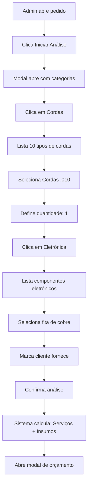

# Atualização Sistema de Insumos V3 - Seleção Manual por Categorias

## 🎯 Problema Resolvido

**Antes:** Sistema suger indo 71 insumos automaticamente → **INVIÁVEL** ❌

**Agora:** Admin escolhe categoria → seleciona apenas os insumos que vai usar → **SIMPLES** ✅

---

## 🔄 O Que Mudou

### Sistema Antigo (REMOVIDO)
```
Serviço vinculado a 20 insumos
  → Pedido com 3 serviços
  → Sistema sugere 60+ insumos
  → Admin precisa desmarcar tudo manualmente
  → INS USTENTÁVEL
```

### Sistema Novo (IMPLEMENTADO)
```
1. Admin clica "Iniciar Análise"
2. Aparece lista de CATEGORIAS (ex: Cordas, Trastes, Eletrônica)
3. Admin clica na categoria que precisa
4. Abre lista APENAS daquela categoria (10-15 itens)
5. Admin seleciona os insumos específicos
6. Define quantidade
7. Marca "cliente fornece" se necessário
8. Confirma
```

---

## 🛠️ Arquivos Já Atualizados

✅ `backend/admin/analise_insumos.php` - Nova API por categorias
✅ `backend/admin/servicos.php` - Sistema de vínculos (OPCIONAL, pode ignorar)

---

## 📝 Próximos Passos MANUAIS

### **Precisamos atualizar o JavaScript do modal em `detalhes.php`**

O modal de análise de insumos precisa ser refeito com a nova interface de categorias.

### Estrutura Visual do Novo Modal:

```
┌──────────────────────────────────────────────────┐
│  ANÁLISE DE INSUMOS                                     │
├──────────────────────────────────────────────────┤
│                                                          │
│  SERVIÇOS DO PEDIDO:                                    │
│  [Setup Completo] [Regulagem] [Limpeza]               │
│                                                          │
│  -----------------------------------------------       │
│                                                          │
│  SELECIONE A CATEGORIA:                                │
│                                                          │
│  [ 📋 Todos ]  [ 🎸 Cordas ]  [ 🔩 Trastes ]            │
│  [ ⚡ Eletrônica ]  [ 🧰 Consumíveis ]                 │
│                                                          │
│  INSUMOS DA CATEGORIA SELECIONADA:                     │
│  [ 🔍 Buscar... ]                                      │
│                                                          │
│  ┌─────────────────────────────────────────────┐  │
│  │ Cordas .009 | R$ 60,00 | Estoque: 5     [+]   │  │
│  │ Cordas .010 | R$ 80,00 | Estoque: 3     [+]   │  │
│  │ Cordas .011 | R$ 85,00 | Estoque: 0     [+]   │  │
│  └─────────────────────────────────────────────┘  │
│                                                          │
│  INSUMOS SELECIONADOS (2):                             │
│  ┌─────────────────────────────────────────────┐  │
│  │ Cordas .010 | [Qtd: 1] | R$ 80,00          │  │
│  │ [ ] Cliente fornece              [× Remover] │  │
│  ├─────────────────────────────────────────────┤  │
│  │ Lixa 220 | [Qtd: 3] | R$ 10,50              │  │
│  │ [✓] Cliente fornece              [× Remover] │  │
│  └─────────────────────────────────────────────┘  │
│                                                          │
│  TOTAL A COBRAR: R$ 80,00                              │
│                                                          │
│  [Cancelar]         [Confirmar e Orçar →]           │
└──────────────────────────────────────────────────┘
```

---

## 👁️ Fluxo de Uso



---

## ✅ Vantagens da Nova Abordagem

| Antes | Agora |
|-------|-------|
| 71 insumos na tela | 5-8 categorias |
| Scroll infinito | Navegação limpa |
| Desmarcar 60 itens | Adiciona só o que precisa |
| Lento e confuso | Rápido e intuitivo |
| Inviável | **Perfeitamente usável** |

---

## 🛠️ Implementação Técnica

### API Endpoints Atualizados:

```javascript
// 1. Carregar dados iniciais
GET /analise_insumos.php?pre_os_id=123
Resposta: {
  categorias: [{nome: "Cordas", icone: "music_note"}, ...],
  insumos_selecionados: [...],
  servicos: [...]
}

// 2. Buscar insumos de uma categoria
GET /analise_insumos.php?categoria=Cordas&q=010
Resposta: {
  insumos: [{id: 5, nome: "Cordas .010", ...}, ...]
}

// 3. Salvar seleção
POST /analise_insumos.php
Body: {
  pre_os_id: 123,
  insumos: [
    {insumo_id: 5, quantidade: 1, cliente_fornece: 0},
    ...
  ]
}
```

---

## 📦 Sistema de Vínculos (OPCIONAL)

O sistema de vincular insumos aos serviços (`servicos.php` atualizado) **ainda funciona**, mas agora é **OPCIONAL**:

- Você **pode** vincular insumos aos serviços se quiser ter uma referência
- Mas esses vínculos **NÃO SERÃO MAIS SUGERIDOS automaticamente**
- Servem apenas como "documentação" do que cada serviço costuma usar

**Recomendação:** Ignore o sistema de vínculos por enquanto. Ele pode ser útil no futuro para relatórios/estatísticas.

---

## 🚀 Próximo Passo

**Preciso atualizar o JavaScript do modal de análise em `detalhes.php`**

Você quer que eu:

1. ✅ Atualize TODO o `detalhes.php` com o novo modal
2. ✅ Crie apenas o JavaScript do novo modal como arquivo separado
3. ✅ Te passe as instruções para você atualizar manualmente

**Qual opção prefere?**
