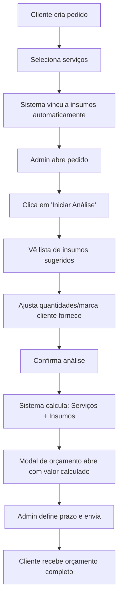

# Sistema de Insumos Vinculados aos Serviços

## 🎯 Objetivo

Resolver o problema de vincular múltiplos insumos de diferentes categorias a cada serviço, permitindo que:

- Serviços simples (ex: "Troca de Trastes Inox") tenham insumos específicos de uma categoria
- Serviços complexos (ex: "Setup Completo + Blindagem") tenham insumos de várias categorias diferentes
- Cada pedido sugira automaticamente os insumos necessários
- O admin possa ajustar manualmente os insumos de cada pedido específico

---

## 📦 Como Funciona

### 1. Cadastro de Serviços (Backend)

Ao criar/editar um serviço em **Serviços > Novo Serviço**:

1. Preencha nome, descrição, valor base e prazo
2. Selecione as categorias do serviço
3. **Vincule os insumos necessários:**
   - Busque o insumo pelo nome
   - Clique para adicionar
   - Defina a quantidade padrão (ex: 1 jogo de cordas, 2 metros de fita)
   - Adicione quantos insumos forem necessários, de qualquer categoria

**Exemplo: Setup Completo**
```
Serviço: Setup Completo
Insumos vinculados:
- Cordas .010 (1 unidade)
- Lixa 220 (2 folhas)
- Fita isolante (0.5 metros)
- Óleo para escala (1 frasco)
```

### 2. Criação de Pedido (Frontend Público)

Quando o cliente seleciona "Setup Completo" no formulário público:
- O pedido é criado com o serviço
- Os insumos vinculados são **automaticamente sugeridos**

### 3. Análise de Insumos (Backend)

Ao abrir o pedido em **Detalhes > Iniciar Análise**:

1. O sistema mostra todos os insumos vinculados aos serviços do pedido
2. Você pode:
   - Ajustar quantidades
   - Marcar "Cliente fornece" para descontar do orçamento
   - Adicionar insumos extras manualmente
   - Remover insumos desnecessários
3. Ao confirmar, o sistema:
   - Atualiza o status para "Em Análise"
   - Calcula automaticamente: **Valor Total = Serviços + Insumos**
   - Abre o modal de orçamento já com o valor calculado

---

## 📊 Estrutura do Banco de Dados

### Tabela: `servicos_insumos`

| Campo | Tipo | Descrição |
|-------|------|-------------|
| `id` | INT | Chave primária |
| `servico_id` | INT | ID do serviço |
| `insumo_id` | INT | ID do insumo |
| `quantidade_padrao` | DECIMAL(10,3) | Quantidade sugerida |
| `criado_em` | TIMESTAMP | Data de criação |

**Relações:**
- `servico_id` → `servicos.id` (ON DELETE CASCADE)
- `insumo_id` → `insumos.id` (ON DELETE CASCADE)
- **UNIQUE KEY** em `(servico_id, insumo_id)` - evita duplicatas

---

## 🚀 Instalação

### Passo 1: Executar Migração

Acesse **uma única vez**:
```
https://adns.luizpimentel.com/adonis-custom/backend/admin/criar_tabela_servicos_insumos.php
```

O script irá:
1. Criar a tabela `servicos_insumos`
2. Migrar dados da tabela antiga `insumos_servicos` se existir
3. Validar a existência da tabela `insumos`

### Passo 2: Deletar o Script

Após executar, delete o arquivo:
```
backend/admin/criar_tabela_servicos_insumos.php
```

### Passo 3: Vincular Insumos aos Serviços

1. Acesse **Serviços** no admin
2. Edite cada serviço
3. Na seção **"Insumos Vinculados ao Serviço"**:
   - Busque e adicione os insumos necessários
   - Defina quantidades padrão
4. Salve

---

## 📝 Exemplos Práticos

### Serviço Simples: "Troca de Trastes Inox"
```
Insumos vinculados:
- Trastes inox jumbo (24 unidades)
- Lixa 220 (3 folhas)
- Cola para trastes (1 frasco)
```

### Serviço Complexo: "Setup + Blindagem + Reparo de Jack"
```
Insumos vinculados:
Categoria Cordas:
- Cordas .010 (1 jogo)

Categoria Consumíveis:
- Lixa 220 (2 folhas)
- Lixa 400 (1 folha)

Categoria Eletrônica:
- Fita de cobre (1 metro)
- Solda estaño (0.5 metro)
- Jack de guitarra (1 unidade)
- Pote 500k (1 unidade)
```

---

## ⚙️ Fluxo Completo



---

## 🛠️ Manutenção

### Adicionar Novo Insumo a um Serviço

1. Acesse **Serviços** > Editar serviço
2. Busque o novo insumo
3. Clique para adicionar
4. Defina quantidade
5. Salve

### Remover Insumo de um Serviço

1. Acesse **Serviços** > Editar serviço
2. Na lista de insumos selecionados, clique no ícone de **X**
3. Salve

### Alterar Quantidade Padrão

1. Acesse **Serviços** > Editar serviço
2. Altere o valor no campo "Quantidade"
3. Salve

---

## ✅ Vantagens

1. **Automação:** Insumos sugeridos automaticamente em cada pedido
2. **Flexibilidade:** Cada serviço pode ter insumos de qualquer categoria
3. **Precisão:** Cálculo automático de orçamento (serviços + insumos)
4. **Controle:** Admin pode ajustar manualmente em cada pedido
5. **Rastreabilidade:** Histórico de quais insumos foram usados em cada OS

---

## 👁️ Visão do Cliente

Na página de acompanhamento público (`acompanhar.php`), o cliente vê:

- **Serviços solicitados** (apenas nomes, sem valores individuais)
- **Valor total do orçamento** (serviços + insumos calculados pelo admin)
- **Prazo de entrega em dias úteis**
- **Histórico de status**

⚠️ **Importante:** O cliente **não vê** a lista detalhada de insumos nem valores individuais - apenas o valor final.

---

## 📞 Suporte

Dúvidas ou problemas? Entre em contato com o desenvolvedor.
